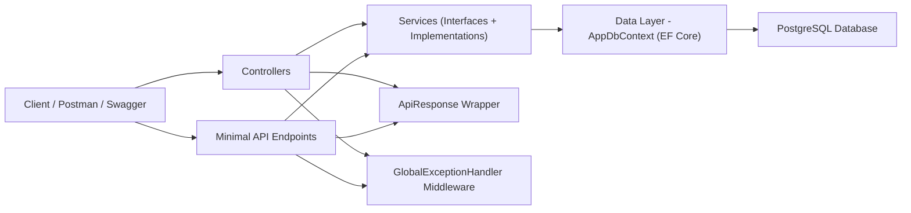

# Net9WebApi — .NET 9 REST API (Controller + Minimal API)

Bu proje, **.NET 9** ile geliştirilmiş bir **JSON tabanlı REST API** uygulamasıdır.  
Ödev gereksinimleri kapsamında:
- **Katmanlı mimari (Controller–Service–Data)** kullanılmıştır.
- CRUD işlemleri hem **Controller** hem de **Minimal API** tarafında uygulanmıştır.
- **Entity Framework Core** ile veritabanı yönetimi yapılmış, **migration** uygulanmıştır.
- Tüm endpoint’ler **Swagger/OpenAPI** üzerinden görüntülenebilir.
- Standart API cevap formatı **ApiResponse<T>** ile sağlanmıştır.
- **Global exception handling** uygulanmıştır.
- Bonus kapsamında **JWT Auth** ve **Seed Data** eklenmiştir.

---

## Mimari Diagram

